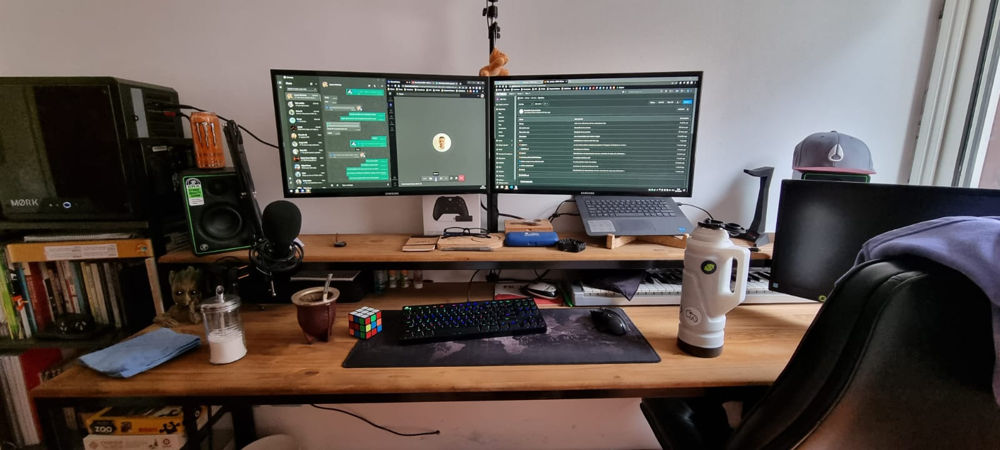

# Hello World 👋 It's [JuanMa!](https://www.linkedin.com/in/juanmanuelchico/)
### I'm a Frontend developer with my ♥ in [React](https://reactjs.org), I have a [Twitch](https://www.twitch.tv/mrbuggamer) channel

 
	
 

 

#### This is my setUp for work
 

 

 
	
 

## What i'm up to
-   🔭 I’m currently working @ [FK{Tech}](https://www.linkedin.com/company/fk-tech-srl/mycompany/).
-   🌱 I’m currently working with [React](https://reactjs.org).
     
## Languages and Tools

<code></code>
<code></code>
<code></code>
<code></code>
<code></code>
<code></code>